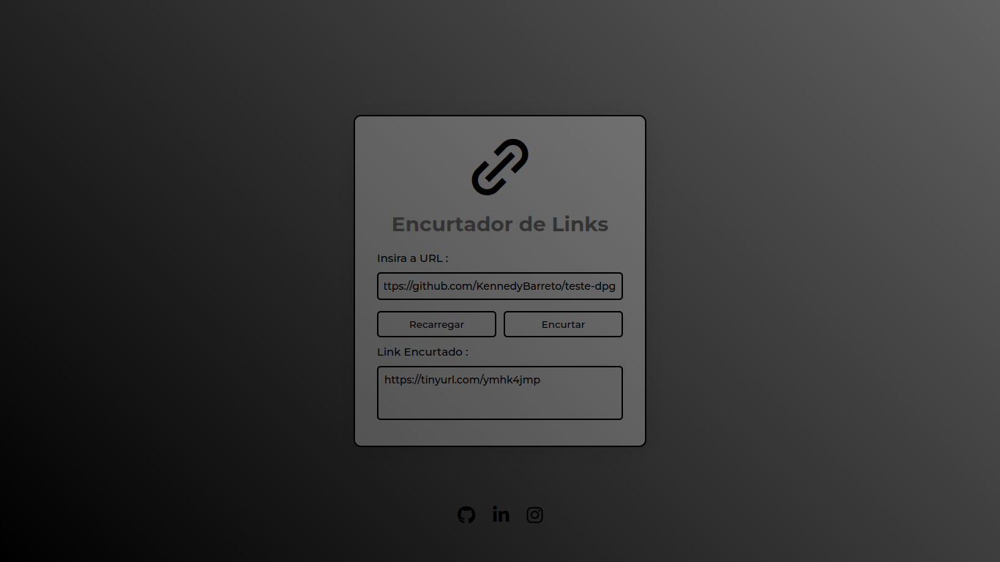

 
  

  &#xa0;

  <a href ="https://kennedybarreto.github.io/teste-dpg/">Demo </a> 

<h1 align="center">Encurtador de URLs</h1>

  

  

  

  

<!-- Status -->

<!-- <h4 align="center"> 
	🚧  Calculadora Simples 🚀 Em construção...  🚧
</h4> 

 -->

  <a href="#dart-sobre">Sobre</a> &#xa0; | &#xa0; 
  <a href="#sparkles-funcionalidades">Funcionalidades</a> &#xa0; | &#xa0;
  <a href="#rocket-tecnologias">Tecnologias</a> &#xa0; | &#xa0;
  <a href="#white_check_mark-pré-requisitos">Pré requisitos</a> &#xa0; | &#xa0;
  <a href="#checkered_flag-começando">Começando</a> &#xa0; | &#xa0;
  <a href="#memo-licença">Licença</a> &#xa0; | &#xa0;
  <a href="https://github.com/KennedyBarreto" target="_blank">Autor</a>

 

## :dart: Sobre ##

 Encurtador de URL feito utilizando a API do <a href="https://tinyurl.com/app/dev">TinyUrl</a>

## :sparkles: Funcionalidades ##

:heavy_check_mark: Transforma Links/URLs em versões menores

## :rocket: Tecnologias ##

As seguintes ferramentas foram usadas na construção do projeto:

- [HTML](https://developer.mozilla.org/pt-BR/docs/Web/HTML)
- [CSS](https://developer.mozilla.org/pt-BR/docs/Web/CSS)
- [JS](https://developer.mozilla.org/pt-BR/docs/Web/JavaScript)

## :white_check_mark: Pré requisitos ##

Nenhum pré requisito necessário :checkered_flag:

## :checkered_flag: Começando ##

Basta Clonar/Copiar o repositório em sua máquina e abrir através de um navegador.

## :memo: Licença ##

Este projeto está sob licença MIT. Veja o arquivo [LICENSE](LICENSE.md) para mais detalhes.

Feito com :heart: por <a href="https://github.com/KennedyBarreto" target="_blank">Kennedy Barreto</a>

&#xa0;

<a href="#top">Voltar para o topo</a>
